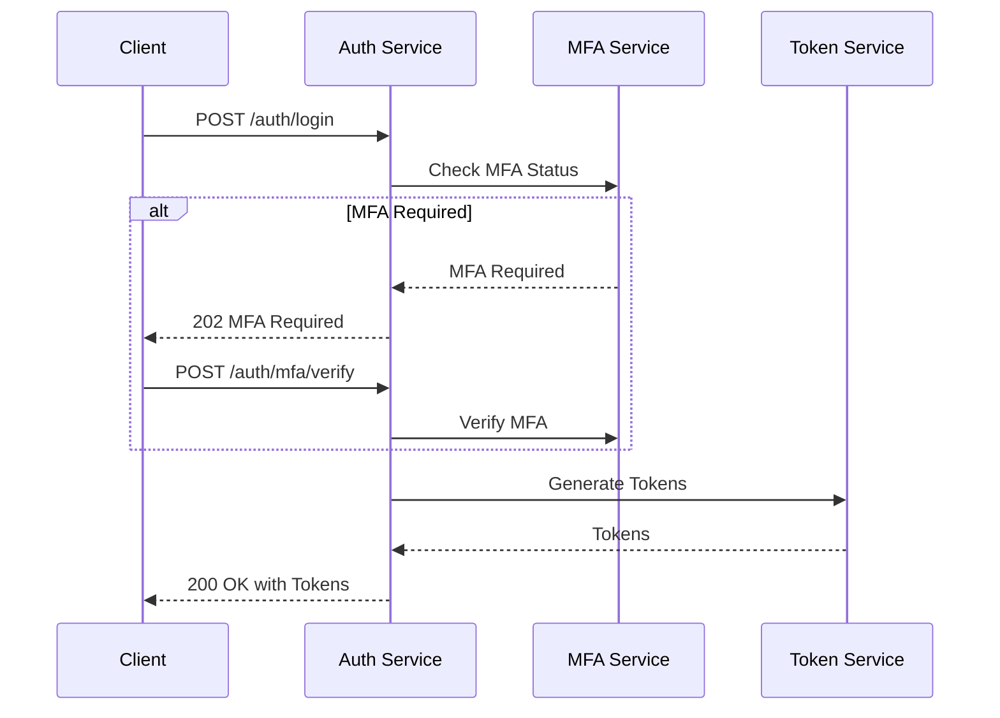

# LaneRunner API Documentation

## Overview
This document provides comprehensive documentation for the LaneRunner API, including endpoints, authentication, rate limiting, error handling, and real-time communication.

## 1. Authentication

### 1.1 JWT Authentication
```typescript
interface AuthenticationResponse {
  access_token: string;
  refresh_token: string;
  expires_in: number;
  token_type: 'Bearer';
}

// POST /api/auth/login
interface LoginRequest {
  email: string;
  password: string;
  mfa_code?: string;
}

// POST /api/auth/refresh
interface RefreshRequest {
  refresh_token: string;
}

// POST /api/auth/mfa/setup
interface MFASetupRequest {
  type: 'totp' | 'sms';
  phone_number?: string;
}

interface MFASetupResponse {
  secret?: string;
  qr_code_url?: string;
  backup_codes: string[];
}

// POST /api/auth/mfa/verify
interface MFAVerifyRequest {
  code: string;
  type: 'totp' | 'sms' | 'backup';
}
```

### 1.2 Rate Limiting
- Default: 100 requests per minute per IP
- Authenticated: 1000 requests per minute per user
- Burst: 50 requests per second
- WebSocket: 100 messages per minute per connection
- Headers:
  - X-RateLimit-Limit: Maximum requests allowed in the window
  - X-RateLimit-Remaining: Remaining requests in current window
  - X-RateLimit-Reset: Time in seconds until the limit resets
  - X-RateLimit-Window: Time window in seconds

### 1.3 Authentication Flow


## 2. Error Handling

### 2.1 Error Format
```typescript
interface ErrorResponse {
  error: {
    code: string;
    message: string;
    details?: Record<string, any>;
    request_id: string;
    correlation_id?: string;
    service?: string;
  };
  status: number;
  timestamp: string;
}
```

### 2.2 Common Error Codes
```typescript
enum ErrorCode {
  // Authentication errors (401, 403)
  UNAUTHORIZED = 'unauthorized',
  INVALID_CREDENTIALS = 'invalid_credentials',
  TOKEN_EXPIRED = 'token_expired',
  INSUFFICIENT_PERMISSIONS = 'insufficient_permissions',
  MFA_REQUIRED = 'mfa_required',
  MFA_INVALID = 'mfa_invalid',
  
  // Request errors (400)
  INVALID_REQUEST = 'invalid_request',
  VALIDATION_ERROR = 'validation_error',
  RATE_LIMIT_EXCEEDED = 'rate_limit_exceeded',
  MISSING_REQUIRED_FIELD = 'missing_required_field',
  INVALID_FORMAT = 'invalid_format',
  
  // Resource errors (404, 409)
  NOT_FOUND = 'not_found',
  ALREADY_EXISTS = 'already_exists',
  CONFLICT = 'conflict',
  RESOURCE_LOCKED = 'resource_locked',
  STALE_DATA = 'stale_data',
  
  // Server errors (500, 503)
  INTERNAL_ERROR = 'internal_error',
  SERVICE_UNAVAILABLE = 'service_unavailable',
  DATABASE_ERROR = 'database_error',
  EXTERNAL_SERVICE_ERROR = 'external_service_error',
  RATE_CALCULATION_ERROR = 'rate_calculation_error'
}
```

### 2.3 Error Response Examples
```typescript
// 400 Bad Request
{
  "error": {
    "code": "validation_error",
    "message": "Invalid request parameters",
    "details": {
      "origin.zip": "Invalid ZIP code format",
      "rate.amount": "Must be greater than 0"
    },
    "request_id": "req_123abc",
    "service": "load-service"
  },
  "status": 400,
  "timestamp": "2025-02-07T14:06:35-07:00"
}

// 401 Unauthorized
{
  "error": {
    "code": "token_expired",
    "message": "Access token has expired",
    "request_id": "req_456def",
    "service": "auth-service"
  },
  "status": 401,
  "timestamp": "2025-02-07T14:06:35-07:00"
}
```

## 3. Load Management

### 3.1 Create Load
```typescript
// POST /api/loads
interface CreateLoadRequest {
  origin: {
    address: string;
    city: string;
    state: string;
    zip: string;
    datetime: string;
    contact: {
      name: string;
      phone: string;
      email?: string;
    };
    instructions?: string;
  };
  destination: {
    address: string;
    city: string;
    state: string;
    zip: string;
    datetime: string;
    contact: {
      name: string;
      phone: string;
      email?: string;
    };
    instructions?: string;
  };
  equipment: {
    type: string;
    length?: number;
    weight?: number;
    requirements?: string[];
  };
  commodity: {
    type: string;
    weight: number;
    pieces?: number;
    hazmat?: boolean;
    temperature?: {
      min: number;
      max: number;
      unit: 'F' | 'C';
    };
  };
  rate: {
    amount: number;
    currency: string;
    type: 'flat' | 'per_mile';
    detention?: {
      free_time: number;
      rate: number;
    };
    additional_stops?: {
      rate: number;
      per: 'stop' | 'mile';
    };
  };
  documents?: {
    type: string;
    url: string;
    required: boolean;
  }[];
}

interface CreateLoadResponse {
  load_id: string;
  status: LoadStatus;
  created_at: string;
  tracking_url: string;
  matching: {
    status: 'searching' | 'matched' | 'failed';
    carrier_count?: number;
  };
}
```

### 3.2 Search Loads
```typescript
// GET /api/loads/search
interface SearchLoadsRequest {
  origin_city?: string;
  origin_state?: string;
  origin_radius?: number;
  destination_city?: string;
  destination_state?: string;
  destination_radius?: number;
  equipment_type?: string[];
  pickup_date_start?: string;
  pickup_date_end?: string;
  delivery_date_start?: string;
  delivery_date_end?: string;
  rate_min?: number;
  rate_max?: number;
  weight_min?: number;
  weight_max?: number;
  status?: LoadStatus[];
  sort_by?: 'rate' | 'pickup_date' | 'created_at';
  sort_order?: 'asc' | 'desc';
  page?: number;
  limit?: number;
}

interface SearchLoadsResponse {
  loads: Load[];
  total: number;
  page: number;
  limit: number;
  aggregations: {
    equipment_types: {
      type: string;
      count: number;
    }[];
    origin_states: {
      state: string;
      count: number;
    }[];
    rate_ranges: {
      min: number;
      max: number;
      count: number;
    }[];
  };
}
```

## 4. Rate Management

### 4.1 Get Rate Quote
```typescript
// POST /api/rates/quote
interface RateQuoteRequest {
  origin: {
    city: string;
    state: string;
    zip: string;
    coordinates?: {
      lat: number;
      lng: number;
    };
  };
  destination: {
    city: string;
    state: string;
    zip: string;
    coordinates?: {
      lat: number;
      lng: number;
    };
  };
  equipment_type: string;
  weight: number;
  pickup_date: string;
  special_requirements?: string[];
  market_conditions?: {
    include_historical?: boolean;
    include_forecast?: boolean;
    confidence_threshold?: number;
  };
}

interface RateQuoteResponse {
  quote_id: string;
  amount: number;
  currency: string;
  confidence: number;
  market_data: {
    current: {
      average: number;
      min: number;
      max: number;
      volume: number;
      trend: 'up' | 'down' | 'stable';
    };
    historical?: {
      daily: {
        date: string;
        average: number;
        volume: number;
      }[];
      weekly_trend: number;
      monthly_trend: number;
    };
    forecast?: {
      next_week: {
        expected: number;
        range: {
          min: number;
          max: number;
        };
      };
      next_month: {
        expected: number;
        range: {
          min: number;
          max: number;
        };
      };
    };
  };
  factors: {
    name: string;
    impact: number;
    description: string;
  }[];
  expires_at: string;
}
```

### 4.2 Accept Rate
```typescript
// POST /api/rates/{quote_id}/accept
interface AcceptRateRequest {
  load_id: string;
  carrier_id?: string;
  payment_terms?: {
    type: 'quickpay' | 'standard' | 'factoring';
    factoring_company?: string;
  };
  additional_services?: {
    type: string;
    rate: number;
  }[];
}

interface AcceptRateResponse {
  booking_id: string;
  status: BookingStatus;
  rate: {
    base_amount: number;
    additional_services: {
      type: string;
      amount: number;
    }[];
    total_amount: number;
    currency: string;
  };
  payment: {
    terms: string;
    expected_date: string;
  };
  confirmation_url: string;
  documents: {
    type: string;
    url: string;
    required: boolean;
  }[];
}
```

## 5. Real-time Communication

### 5.1 WebSocket Connection
```typescript
// WebSocket URL: wss://api.lanerunner.com/ws
interface WebSocketAuthRequest {
  type: 'auth';
  token: string;
}

interface WebSocketEvent {
  type: string;
  payload: any;
  timestamp: string;
  sequence_number: number;
}

interface WebSocketError {
  type: 'error';
  code: string;
  message: string;
  timestamp: string;
}
```

### 5.2 Event Types
```typescript
enum WebSocketEventType {
  // Load events
  LOAD_CREATED = 'load.created',
  LOAD_UPDATED = 'load.updated',
  LOAD_DELETED = 'load.deleted',
  LOAD_MATCHED = 'load.matched',
  
  // Rate events
  RATE_UPDATED = 'rate.updated',
  MARKET_UPDATE = 'market.update',
  
  // Booking events
  BOOKING_CREATED = 'booking.created',
  BOOKING_UPDATED = 'booking.updated',
  BOOKING_CANCELLED = 'booking.cancelled',
  
  // Tracking events
  LOCATION_UPDATED = 'tracking.location_updated',
  STATUS_UPDATED = 'tracking.status_updated',
  ETA_UPDATED = 'tracking.eta_updated',
  
  // System events
  RECONNECT = 'system.reconnect',
  MAINTENANCE = 'system.maintenance'
}
```

### 5.3 Subscription Management
```typescript
// Subscribe to events
interface SubscriptionRequest {
  type: 'subscribe';
  channels: string[];
}

// Unsubscribe from events
interface UnsubscriptionRequest {
  type: 'unsubscribe';
  channels: string[];
}

// Subscription confirmation
interface SubscriptionResponse {
  type: 'subscribed' | 'unsubscribed';
  channels: string[];
  timestamp: string;
}
```

## 6. API Versioning

### 6.1 Version Header
All requests should include the API version header:
```
X-API-Version: 2025-02-07
```

### 6.2 Version Lifecycle
- New versions are released with a date-based identifier
- Multiple versions are supported simultaneously
- Deprecation notices are sent 6 months in advance
- Emergency changes may be made with 24-hour notice

### 6.3 Version Changelog
Each version change includes:
- Breaking changes
- New features
- Bug fixes
- Performance improvements
- Security updates

## 7. Best Practices

### 7.1 Request Guidelines
1. Always include appropriate headers:
   ```
   Content-Type: application/json
   Accept: application/json
   X-API-Version: 2025-02-07
   Authorization: Bearer <token>
   ```

2. Use appropriate HTTP methods:
   - GET: Retrieve resources
   - POST: Create resources
   - PUT: Update resources
   - DELETE: Remove resources
   - PATCH: Partial updates

3. Handle rate limiting:
   - Monitor rate limit headers
   - Implement exponential backoff
   - Use bulk endpoints when available

### 7.2 Response Handling
1. Status code ranges:
   - 2xx: Success
   - 3xx: Redirection
   - 4xx: Client errors
   - 5xx: Server errors

2. Error handling:
   - Always check error responses
   - Log error details
   - Implement retry logic
   - Handle maintenance windows

3. Performance optimization:
   - Use compression
   - Implement caching
   - Batch requests
   - Use conditional requests

### 7.3 WebSocket Guidelines
1. Connection management:
   - Implement heartbeat
   - Handle reconnection
   - Buffer messages
   - Monitor connection quality

2. Event handling:
   - Process events in order
   - Handle duplicate events
   - Implement event replay
   - Monitor message rates

3. Error recovery:
   - Handle connection drops
   - Resubscribe on reconnect
   - Sync missed events
   - Monitor event gaps
