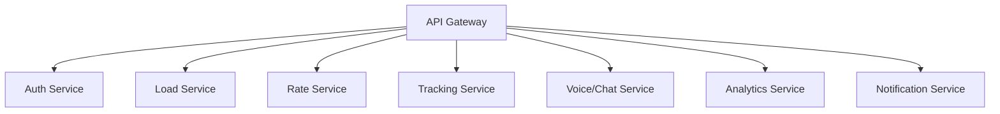
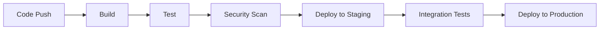

# LaneRunner Microservices Architecture

## 1. System Overview

### 1.1 Core Services


### 1.2 Infrastructure Components
- **API Gateway**: Kong/Traefik
- **Service Mesh**: Istio
- **Container Orchestration**: Kubernetes
- **Message Broker**: RabbitMQ/Kafka
- **Monitoring**: Prometheus + Grafana
- **Logging**: ELK Stack
- **Tracing**: Jaeger

## 2. Service Specifications

### 2.1 Auth Service
- **Purpose**: Handle authentication, authorization, and user management
- **Key Features**:
  - JWT token management
  - MFA implementation
  - RBAC management
  - Session handling
- **Tech Stack**:
  - NestJS
  - PostgreSQL (via Supabase)
  - Redis (session store)
- **Dependencies**:
  - Supabase Auth
  - Redis
  - PostgreSQL
- **NestJS Modules**:
  - AuthModule
  - UsersModule
  - RolesModule
  - SessionModule

### 2.2 Load Service
- **Purpose**: Manage load posting, matching, and lifecycle
- **Key Features**:
  - Load CRUD operations
  - Smart matching
  - Document management
  - Rate calculation
- **Tech Stack**:
  - NestJS
  - PostgreSQL
  - Elasticsearch
- **Dependencies**:
  - Rate Service
  - Analytics Service
  - Document Service
- **NestJS Modules**:
  - LoadsModule
  - MatchingModule
  - DocumentsModule
  - RatesModule

### 2.3 Rate Service
- **Purpose**: Handle rate calculations and optimization
- **Key Features**:
  - Real-time rate calculation
  - Market data analysis
  - Rate negotiation
  - Historical analysis
- **Tech Stack**:
  - NestJS
  - PostgreSQL
  - Redis (caching)
- **Dependencies**:
  - Analytics Service
  - Market Data Service
  - AI Service
- **NestJS Modules**:
  - RatesModule
  - MarketDataModule
  - OptimizationModule
  - HistoryModule

### 2.4 Tracking Service
- **Purpose**: Real-time shipment tracking and updates
- **Key Features**:
  - GPS tracking
  - Status updates
  - ETA calculation
  - Geofencing
- **Tech Stack**:
  - NestJS
  - MongoDB
  - Redis (real-time)
- **Dependencies**:
  - Maps Service
  - Notification Service
  - Weather Service
- **NestJS Modules**:
  - TrackingModule
  - GeofencingModule
  - ETAModule
  - LocationModule

### 2.5 Voice/Chat Service
- **Purpose**: Handle all communication features
- **Key Features**:
  - Real-time chat
  - Voice calls
  - AI-powered responses
  - Message history
- **Tech Stack**:
  - NestJS
  - MongoDB
  - WebSocket (via @nestjs/websockets)
- **Dependencies**:
  - Twilio
  - AI Service
  - Notification Service
- **NestJS Modules**:
  - ChatModule
  - VoiceModule
  - AIModule
  - WebsocketModule

### 2.6 Analytics Service
- **Purpose**: Data analysis and reporting
- **Key Features**:
  - Performance metrics
  - Market analysis
  - Predictive analytics
  - Custom reports
- **Tech Stack**:
  - NestJS
  - PostgreSQL
  - Apache Spark
- **Dependencies**:
  - All other services (data collection)
- **NestJS Modules**:
  - AnalyticsModule
  - ReportingModule
  - MetricsModule
  - PredictionModule

### 2.7 Notification Service
- **Purpose**: Handle all system notifications
- **Key Features**:
  - Push notifications
  - Email notifications
  - SMS notifications
  - In-app alerts
- **Tech Stack**:
  - NestJS
  - Redis
  - RabbitMQ
- **Dependencies**:
  - Email Service (SendGrid)
  - SMS Service (Twilio)
  - Push Notification Service
- **NestJS Modules**:
  - NotificationModule
  - EmailModule
  - SMSModule
  - PushModule

## 3. Data Flow Architecture

### 3.1 Synchronous Communication
- REST APIs for direct service-to-service communication
- GraphQL for complex data queries
- gRPC for high-performance internal communication

### 3.2 Asynchronous Communication
- Event-driven architecture using RabbitMQ/Kafka
- WebSocket for real-time updates
- Message queues for background tasks

### 3.3 Data Consistency
- Saga pattern for distributed transactions
- Event sourcing for audit trails
- CQRS for complex data operations

## 4. Infrastructure Requirements

### 4.1 Kubernetes Configuration
```yaml
environments:
  production:
    clusters: 3
    nodes_per_cluster: 5
    regions: ["us-west", "us-east", "eu-west"]
  staging:
    clusters: 1
    nodes_per_cluster: 3
    regions: ["us-west"]
  development:
    clusters: 1
    nodes_per_cluster: 2
    regions: ["us-west"]
```

### 4.2 Resource Requirements
- **Minimum Node Specifications**:
  - CPU: 4 cores
  - RAM: 16GB
  - Storage: 100GB SSD
- **Scaling Thresholds**:
  - CPU: 70%
  - Memory: 80%
  - Request Rate: 1000 req/s

### 4.3 Network Requirements
- **Bandwidth**: 1Gbps minimum
- **Latency**: <100ms between services
- **Load Balancing**: Round-robin with health checks

## 5. Security Architecture

### 5.1 Service Security
- mTLS between services
- Network policies
- Service accounts
- Secret management (HashiCorp Vault)

### 5.2 Data Security
- Encryption at rest
- Encryption in transit
- Regular security audits
- Compliance monitoring

### 5.3 Access Control
- RBAC implementation
- API authentication
- Rate limiting
- IP whitelisting

## 6. Monitoring and Observability

### 6.1 Metrics Collection
- Service metrics
- Business metrics
- Infrastructure metrics
- Custom metrics

### 6.2 Logging
- Centralized logging
- Log aggregation
- Log retention policies
- Log analysis

### 6.3 Alerting
- Service health alerts
- Performance alerts
- Security alerts
- Business metric alerts

## 7. Deployment Strategy

### 7.1 CI/CD Pipeline


### 7.2 Deployment Patterns
- Blue-Green deployments
- Canary releases
- Feature flags
- Rollback procedures

## 8. Current Status and Next Steps

### 8.1 Implemented Services
- Basic Auth Service
- Basic Load Service
- Basic Rate Service
- Basic Tracking Service

### 8.2 Priority Implementation Order
1. Complete Auth Service with MFA
2. Enhance Load Service with AI matching
3. Implement Voice/Chat Service
4. Deploy Analytics Service
5. Set up comprehensive monitoring
6. Implement remaining services

### 8.3 Migration Strategy
1. Gradual service separation
2. Data migration planning
3. Zero-downtime transition
4. Feature parity validation

## 9. Development Guidelines

### 9.1 Service Development Standards
- API-first design
- OpenAPI/Swagger documentation
- Error handling standards
- Testing requirements

### 9.2 Code Organization
- Consistent project structure
- Shared libraries management
- Version control strategy
- Documentation requirements

### 9.3 Testing Strategy
- Unit testing (80% coverage minimum)
- Integration testing
- Performance testing
- Security testing

## 10. Disaster Recovery

### 10.1 Backup Strategy
- Database backups
- Configuration backups
- Cross-region replication
- Recovery time objectives

### 10.2 Failover Procedures
- Service failover
- Region failover
- Data center failover
- Communication plan

## 11. NestJS-Specific Architecture

### 11.1 Module Organization
```typescript
// Example module structure for each service
@Module({
  imports: [
    ConfigModule.forRoot(),
    TypeOrmModule.forRoot(),
    RedisModule.forRoot(),
    CommonModule,
    // Feature-specific modules
  ],
  controllers: [],
  providers: [],
  exports: [],
})
export class ServiceModule {}
```

### 11.2 Microservice Transport
```typescript
// Example microservice configuration
const app = await NestFactory.createMicroservice<MicroserviceOptions>(AppModule, {
  transport: Transport.RMQ,
  options: {
    urls: ['amqp://localhost:5672'],
    queue: 'service_queue',
    queueOptions: {
      durable: false
    },
  },
});
```

### 11.3 Inter-Service Communication
- **Synchronous**: HTTP via @nestjs/axios
- **Asynchronous**: Message patterns via @nestjs/microservices
- **Events**: Event patterns for pub/sub
- **WebSockets**: @nestjs/websockets for real-time

### 11.4 Common Patterns
- Guards for authentication
- Interceptors for logging/transformation
- Pipes for validation
- Exception filters for error handling
- Custom decorators for business logic

### 11.5 Testing Strategy
- Unit testing with @nestjs/testing
- E2E testing with supertest
- Integration testing with test containers
- Performance testing with autocannon
